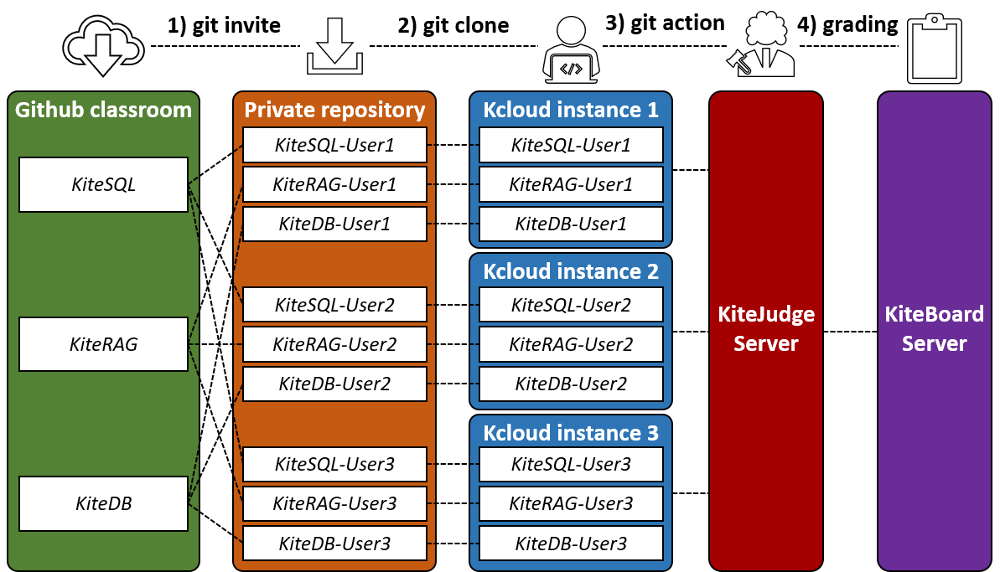
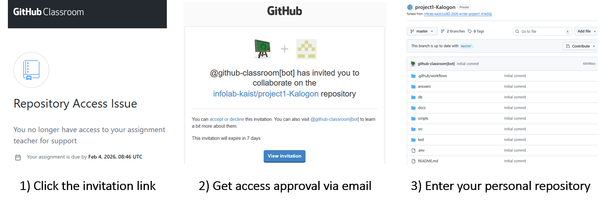

# Kite Project

Welcome to the KAIST Infolab Task-driven Educational Project, a.k.a **Kite Project**. This project is a comprehensive, hands-on educational initiative designed to provide students with practical experience in building advanced data systems. This project targets specific skills in database management, information retrieval, and system architecture.

Our goal is to bridge the gap between theoretical knowledge and real-world implementation. You will not just learn concepts; you will build them.

---

## Project Components

The current curriculum consists of three projects:

1.  **KiteSQL**  
    Focuses on mastering SQL queries, schema design, and database interaction using MySQL. You will act as a DBA managing a complex dataset.
    
2.  **KiteRAG**  
    Dive into the world of AI with Retrieval-Augmented Generation. You will build a system that retrieves relevant information to ground LLM responses, learning about vector databases and semantic search.

3.  **KiteDB**  
    The capstone project where you implement core database internals. This involves understanding storage engines and query processing.

---

## Kite Project Workflow

<p align="center">
  
</p>

The overall workflow follows these key steps:
1.  **Invitation**: Accept the assignment invitation via GitHub Classroom to get your private repository.
2.  **Clone and Implement**: Clone your private repository to the Kcloud environment. Implement your code according to the instruction. You can test your code locally using the provided scripts.
3.  **Submit**: Commit your changes to `master`, then run `./scripts/submit.sh` to push your code to the `submit` branch. Submission is automatically triggered when changes are pushed to the `submit` branch.
4.  **Grade and Compete**: Check your scores and rankings on KiteBoard and win awards.

> [!IMPORTANT]
> To submit your work, first commit all intended changes to the `master` branch, then run `./scripts/submit.sh`. This script force-pushes `master` to the `submit` branch and triggers submission to the judge server. For example:
> ```bash
> git config --global user.name "Your Name"
> git config --global user.email "you@example.com"
> git add src/
> git commit -m "Finalize submission"
> git push origin master
> ./scripts/submit.sh
> ```

---

## Platform & Access

We utilize GitHub Classroom for all assignment distribution and submission. 

- **Invitation Link**: The official invitation link will be posted on KLMS. 

- **Privacy Rules**: 
    - 🚫 **Do NOT share the invitation link.** It is for enrolled students *only*.
    - 🚫 **Do NOT Fork or Publicize.** Your repository must remain private. Publicly forking the repository or sharing your code is a violation of academic integrity.


You must complete the following steps to finish the invitation:
1. Click the invitation link
2. Get access approval via email
3. Enter your personal repository

<p align="center">
  
</p>

---

## Repository Structure

The project repository is organized to separate documentation, source code, and operational scripts.

### `docs/` — Documentation
*   **`instructions.md`**: The primary guide for each project. **Start here.** It lists every task you need to complete.
*   **Supplementary Materials**: Additional `*.md` files may be provided to explain complex concepts or API usage.

### `src/` — Source Code
*   This is your workspace. The entire `src/` folder is submitted for grading.
*   You will find placeholders marked with `/* task */`.
*   **Rule**: You may modify any files within the `src/` directory. All changes in this folder will be reflected in grading.

### `scripts/` — Helper Scripts
We provide a suite of shell scripts to automate common tasks. run these from the project root (e.g., `./scripts/init.sh`).

*   **`init.sh`**: Sets up your local environment. Installs necessary compilers, Python libraries, and other dependencies.
*   **`setdb.sh`**: Initializes the database container. It sets up schemas and populates initial data.
*   **`run.sh`**: Executes the main application. Use this to see your code in action.
*   **`test.sh`**: Runs local test cases. This gives you an estimated correctness score.
*   **`submit.sh`**: Force-pushes your `master` branch to the `submit` branch, triggering automatic submission to the judge server for official grading.

### `.github/workflows/` — CI/CD
*   **`submission.yml`**: Defines the GitHub Actions pipeline.
*   **Automation**: Submission is automatically triggered when changes are pushed to the `submit` branch. The workflow sends the code to the **KiteJudge** server for evaluation.

---

## Evaluation: Competition & Awards

We believe in healthy competition to drive optimization and excellence.

### 1. Correctness Score
*   **Definition**: Points awarded for passing functional test cases.
*   **How to check**: Run `scripts/test.sh`. (Note: Local tests are indicative; KiteJudge server tests are final).
*   **Distribution**:
    - KiteSQL: **100 pts**
    - KiteRAG: **100 pts**
    - KiteDB: **100 pts**

### 2. Competition Score
*   **Definition**: Additional points earned based on the **accuracy** and **efficiency** (speed/memory) of your solution compared to your peers.
*   **Distribution**:
    - KiteSQL: **0 pts** (No competition)
    - KiteRAG: **150 pts** (Accuracy)
    - KiteDB: **150 pts** (Efficiency)

### 3. Final Scoring & Leaderboard
*   **KiteJudge**: The automated grading server evaluates submissions from the `submit` branch.
*   **KiteBoard**: A live leaderboard showing current rankings (Accuracy, Efficiency). Names are anonymized to protect privacy.
*   **Grading Timeline**: Rankings update periodically (e.g., daily). Final scores are graded and posted after the deadline.


### Awards
Outstanding students who are in top of the leaderboards or demonstrate exceptional engineering quality will be awarded **Bonus Points** at the end of the semester.

---

*Good luck, and happy coding!*
